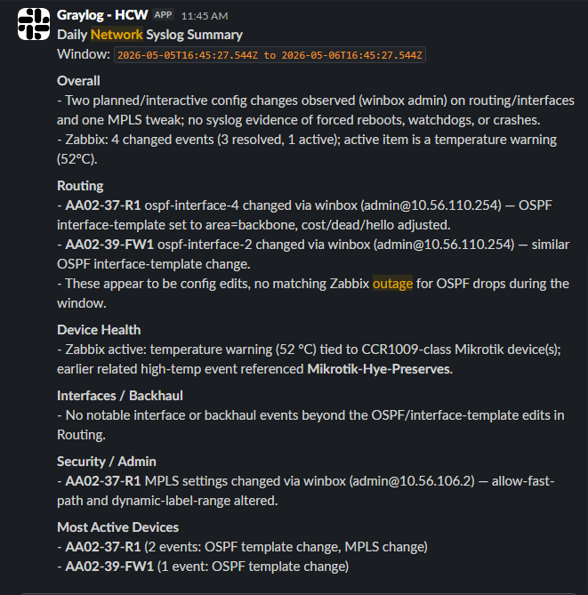

# daily-network-summary

A small Node.js script that builds a daily network digest from Graylog, optionally adds Zabbix SNMP context, summarizes it with OpenAI, and posts it to our Slack.

I use this tool to give me a quick summary of what happened in the network during the off hours to help identify any glaring issues for the day.



## What It Looks At

- Graylog syslog for routing, config changes, reboots, crashes, link events, logins, and other device logs.
- Zabbix problems for reachability, radio/backhaul health, packet loss, interface status, bandwidth, temperature, and power.
- A small local topology/loopback map in `src/site-map.js` so reports can say things like `Crown <-> Roy` instead of only showing loopback IPs.

The app sends OpenAI a compact summary payload, not the entire raw log stream.

## Setup

Requires Node.js 20 or newer.

```bash
npm install
cp .env.example .env
```

Then edit `.env`.

## Environment

Minimum required:

```env
GRAYLOG_URL=https://graylog.example.com
GRAYLOG_TOKEN=your_graylog_token

OPENAI_API_KEY=your_openai_key
OPENAI_MODEL=gpt-4.1-mini

SLACK_WEBHOOK_URL=https://hooks.slack.com/services/xxx/yyy/zzz
```

Common optional settings:

```env
GRAYLOG_TIMEZONE=America/Chicago
GRAYLOG_SEARCH_LIMIT=1000
GRAYLOG_STREAM_IDS=

REPORT_WINDOW_HOURS=24
REPORT_TITLE=Daily Network Syslog Summary

ZABBIX_ENABLED=false
ZABBIX_URL=https://zabbix.example.com
ZABBIX_API_TOKEN=your_zabbix_api_token
ZABBIX_PROBLEM_LIMIT=200

OPENAI_REASONING_EFFORT=minimal
MOCK_MODE=false
```

Use `MOCK_MODE=true` if you want to test OpenAI and Slack without querying Graylog.

## Run It

```bash
npm start
```

For development:

```bash
npm run dev
```

The script runs once, posts to Slack, and exits.

## Cron Example

Run every morning at 7:00:

```cron
0 7 * * * cd /opt/graylog-ai-digest && /usr/bin/node src/index.js >> /var/log/graylog-ai-digest.log 2>&1
```

## Notes

Graylog API versions vary. The endpoint is kept near the top of `src/graylog.js` so it is easy to adjust if needed.

Zabbix is optional. If it is enabled and the API call fails, the report still runs with Graylog only.

Classification rules live in `src/classify.js`. The patterns are intentionally simple regex lists so they are easy to tune as real log wording shows up.

The main report prompt lives in `src/summarize.js`.
